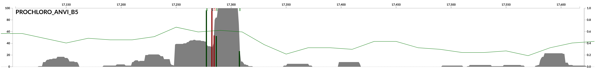

# Marine Biology 740 Short Project 1

Group: Oscar Ramfelt, Gabrielle Stedman

Link to Github repository [here](https://github.com/kolaban/mbio740-short-project1)

## Reference Genome and Sequence Data

The bacterial genome that we selected was Proclorococcus (Refseq: GCF_000007925.1) The reason being that it is one of the most abundant phytoplankton in the ocean. As for the sequence data we decided to select a metagenome from the Tara oceans project under found under ERR315858. These were downloaded using their associated FTP links.

```Bash
wget ftp://ftp.sra.ebi.ac.uk/vol1/fastq/ERR315/ERR315858/ERR315858_1.fastq.gz
wget ftp://ftp.sra.ebi.ac.uk/vol1/fastq/ERR315/ERR315858/ERR315858_2.fastq.gz
```

## Alignment Selection

The two aligners we chose to use were:

1. Bowtie2 version: 2.3.5.1
1. BWA-mem version: 0.7.17

### Bowtie2 Method

Created the index for prochlorococcus and then moved it to a directory called prochloro using:

```Bash
bowtie2-build GCF_000007925.1_ASM792v1_genomic.fna prochloro
mkdir prochloro
mv prochloro* prochloro/
```

Mapped the reads to the index we created using:

```Bash
bowtie2 --threads 6 -x prochloro/prochloro \
        --no-unal \
        -1 ERR315858_1.fastq.gz \
        -2 ERR315858_2.fastq.gz \
        -S prochloro_bowtie_v1.sam
```

To view the alignment stats we used samtools. Where we first converted the sam file into a bam file and then sorted it.

```Bash
samtools view -F 4 -bS prochloro_bowtie_v1.sam > prochloro_bowtie_v1-RAW.bam
samtools sort prochloro_bowtie_v1-RAW.bam -o prochloro_bowtie_v1.bam
samtools index prochloro_bowtie_v1.bam
```

Then viewed the stats using the following command to ouput various stats to the stdout

```Bash
samtools stats prochloro_bowtie_v1.bam
```

We also saved the output from the file into text files to hold the data by using the following command:

```Bash
samtools flagstats prochloro_bowtie_v1.bam
```

Following this run we tried changing the settings to see varying results. To start we tried using a faster alignment using the fast flag which changes various parameters to make the program run faster but be less sensitive. This predefined setting changes various parameters from "-D 15 -R 2 -N 0 -L 22 -i S,1,1.15" to "-D 10 -R 2 -N 0 -L 22 -i S,0,2.50". The various parameters are:

* -D this changes the seed extensions, decreasing its value makes the program faster, but might make "worse" alginments. 
* -R similar to -D but limits the number of times that bowtie will attempt to reseed. Its end result is similar to -D where a greater number makes it more likely that bowtie2 will find the correct location, but make it slower.
* -N changes the number of mismatches to the seed that are allowed. This doesn't vary between the two preest methods we use but can have a significant effect on speed and sensitivity.
* -L Determines the length of the seed substring that should be aligned to. Making it smaller should make the program slower but more sensitive. Also doesn't vary between the two preset methods that we used.
* -i Determines the function that should be used to determine the interval between the string substrings used during multiseed alignment.

```Bash
bowtie2 --threads 6 -x prochloro/prochloro \
        --no-unal --fast \
        -1  ERR315858_1.fastq.gz \
        -2 ERR315858_2.fastq.gz \
        -S prochloro_bowtie_v2.sam
```

And with local alignments instead of global ones, the values for the parameters here are similar to those used in the first alignment with bowtie with them being "-D 15 -R 2 -N 0 -L 20 -i S,1,0.75".

```Bash
bowtie2 --threads 6 -x prochloro/prochloro \
        --no-unal --sensitive-local \
        -1  ERR315858_1.fastq.gz \
        -2 ERR315858_2.fastq.gz \
        -S prochloro_bowtie_v3.sam
```

After running both of these they were transformed into bam files using the method desribed previously. 

### BWA-mem Method

In a seperate directory we ran a similar pipeline for the same metagenome and refrence sequence but used BWA instead of Bowtie2. To start we created an index for BWA using the following code

```Bash
bwa index GCF_000007925.1_ASM792v1_genomic.fna
```

Following the creation of the index we ran the alignment using the following parameters.

```bash
bwa mem GCF_000007925.1_ASM792v1_genomic.fna ERR315858_1.fastq.gz \
        ERR315858_2.fastq.gz -t 6 > prochloro_R1_R2.sam
```

To view the alignment stats we used the same method as specified in the bowtie2 method that is we used the various tools within samtools.

We also tested other options that bwa has available by running the two following alignments as well. To start we made it more strict with mismatching by increasing the -B flag which increases the penalty from mismatches.

```Bash
bwa mem GCF_000007925.1_ASM792v1_genomic.fna ERR315858_1.fastq.gz \
        ERR315858_2.fastq.gz -t 6 -B 5 > prochloro_R1_R2_B5.sam
```

We also tried seeing what happened if we made it more forgiving with the alignments, that is by decreasing the -B flag

```Bash
bwa mem GCF_000007925.1_ASM792v1_genomic.fna ERR315858_1.fastq.gz \
        ERR315858_2.fastq.gz -t 6 -B 3 > prochloro_R1_R2_B3.sam
```

### Selection of "better" method

After taking a look at the output via samtools it seems that the better program that came out with the highest percentage of properly paired reads was BWA. Of the three trials we conducted it turned out that the flag -B set to 5 gave us the best result.

### GC Content and statistical analysis

The file(s) prochloro_R1_R2_B5_visualization.pdf/rmd contain the code and associated information used to analyze the genome recruitment as well as the statistical analysis. These files are available on the github repository. The tables for question 4 can be found in either a csv or tsv format with the directory "data".

### Examples of GC rich vs GC poor regions

Here is an example of the coverage in a GC rich region and a GC poor region, the coverage has been cut off to make the picture easier to see. The green line shows the GC content in that region.



### Final Note

The final bam file produced by BWA was very large so instead of using it we converted the bam file we had back inot sam format since unmapped reads had been removed. To do this we used the following command:

```Bash
samtools view -h -o prochloro_R1_R2_B5_reduced.sam prochloro_R1_R2_B5.bam
```
